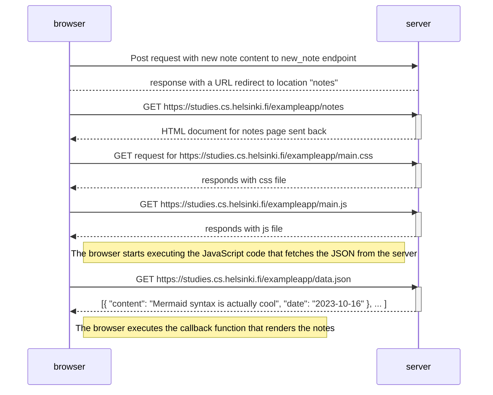

# A diagram depicting a form submission interaction between a client and a server where the response leads to a redirect on the server

```mermaid
sequenceDiagram
  participant browser
  participant server

  browser->>server: Post request with new note content to new_note endpoint
  server-->browser: response with a URL redirect to location "notes"
  browser->>server: GET https://studies.cs.helsinki.fi/exampleapp/notes
  activate server
  server-->>browser: HTML document for notes page sent back
  deactivate server

  browser->>server: GET request for https://studies.cs.helsinki.fi/exampleapp/main.css
  activate server
  server-->>browser: responds with css file
  deactivate server

  browser->>server: GET https://studies.cs.helsinki.fi/exampleapp/main.js
  activate server
  server-->>browser: responds with js file
  deactivate server

  Note right of browser: The browser starts executing the JavaScript code that fetches the JSON from the server

  browser->>server: GET https://studies.cs.helsinki.fi/exampleapp/data.json
  activate server
  server-->>browser: [{ "content": "Mermaid syntax is actually cool", "date": "2023-10-16" }, ... ]
  deactivate server

  Note right of browser: The browser executes the callback function that renders the notes
```
