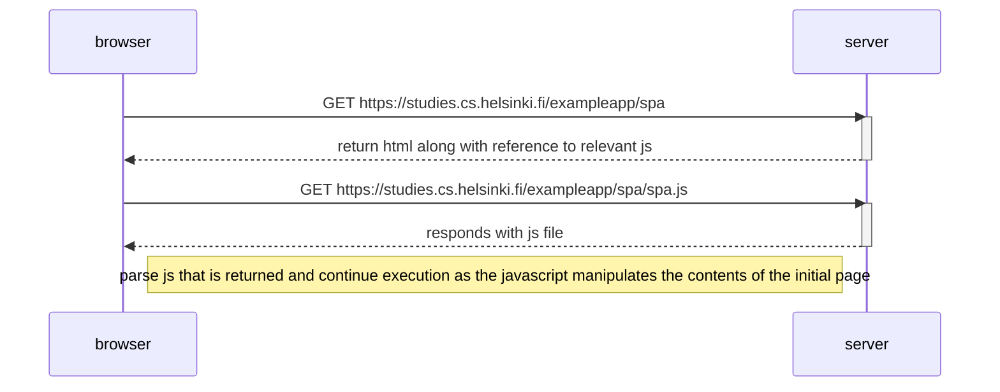

# A diagram depicting a browser's interaction with a server when a single page app is requested

```mermaid
sequenceDiagram
  participant browser
  participant server

  browser->>server: GET https://studies.cs.helsinki.fi/exampleapp/spa
  activate server
  server-->>browser: return html along with reference to relevant js
  deactivate server

  browser->>server: GET https://studies.cs.helsinki.fi/exampleapp/spa/spa.js
  activate server
  server-->>browser: responds with js file
  deactivate server
  
  Note right of browser: parse js that is returned and continue execution as the javascript manipulates the contents of the initial page
```
